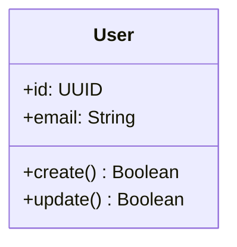
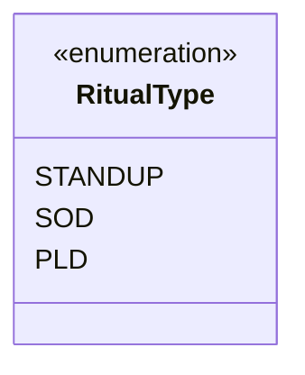

# UML Style Guide - Holberton Rituals

## General Principles

### 1. Clarity First
- Each diagram should be self-explanatory
- Use meaningful names that reflect purpose
- Keep diagrams focused and concise
- Split complex diagrams when they exceed 15 classes

### 2. Naming Conventions

#### Classes
```typescript
class UserManager     // ✅ Correct
class userManager    // ❌ Incorrect
class User_Manager   // ❌ Incorrect
```

#### Properties
```typescript
+firstName: String          // ✅ Correct
+FirstName: String         // ❌ Incorrect
+first_name: String       // ❌ Incorrect
```

#### Methods
```typescript
+calculateScore()          // ✅ Correct
+CalculateScore()         // ❌ Incorrect
+calculate_score()        // ❌ Incorrect
```

### 3. Relationships

#### Cardinality
```mermaid
classDiagram
    User "1" -- "1" Profile    %% One-to-One
    User "1" -- "*" Post       %% One-to-Many
    User "*" -- "*" Group      %% Many-to-Many
```

### 4. Documentation

#### Required Elements
- Class purpose
- Property types
- Method return types
- Relationship explanations

#### Example


### 5. Layout Guidelines

#### Hierarchy
- Core classes at the top
- Dependencies below
- Related classes grouped together
- Minimize crossing lines

#### Spacing
- Consistent spacing between classes
- Align related elements
- Use appropriate padding
- Maximum 3 levels deep

### 6. Enumerations



### 7. File Organization

```
docs/
└── uml/
    ├── core/
    │   └── *.mmd
    ├── rituals/
    │   └── *.mmd
    └── global.mmd
```

### 8. Review Process

#### Before Submission
- [ ] Follows naming conventions
- [ ] Relationships properly defined
- [ ] Documentation complete
- [ ] Layout optimized
- [ ] No redundant elements

#### Review Criteria
1. Technical accuracy
2. Visual clarity
3. Documentation completeness
4. Consistency with existing diagrams

### 9. Version Control

#### Commit Messages
```git
feat(uml): add user authentication diagram
fix(uml): correct relationship in StandUp
docs(uml): update style guide
```

### 10. Tools and Settings

#### Required Extensions
- Mermaid Editor
- Markdown Preview Enhanced

#### Recommended Settings
```json
{
    "mermaid-editor.preview.defaultMermaidConfig": "./mermaid.config.json"
}
```

## Best Practices

### DO
- Keep diagrams focused and purpose-driven
- Use consistent terminology
- Document all non-obvious relationships
- Regular updates with codebase changes

### DON'T
- Mix different levels of abstraction
- Create circular dependencies
- Leave relationships unexplained
- Duplicate information

## Examples

### Good Example
[Link to exemplary diagram]

### Common Mistakes
[Link to anti-patterns]

## Updates

This guide is living documentation. Submit updates via PR with:
1. Proposed changes
2. Rationale
3. Examples
