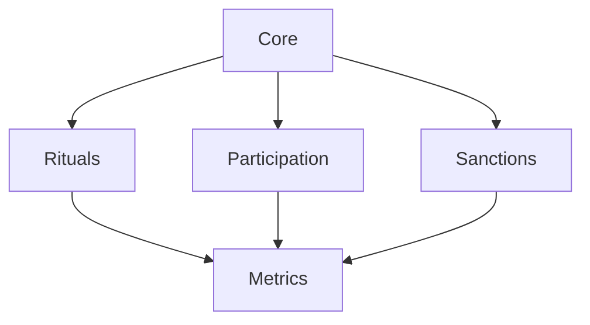
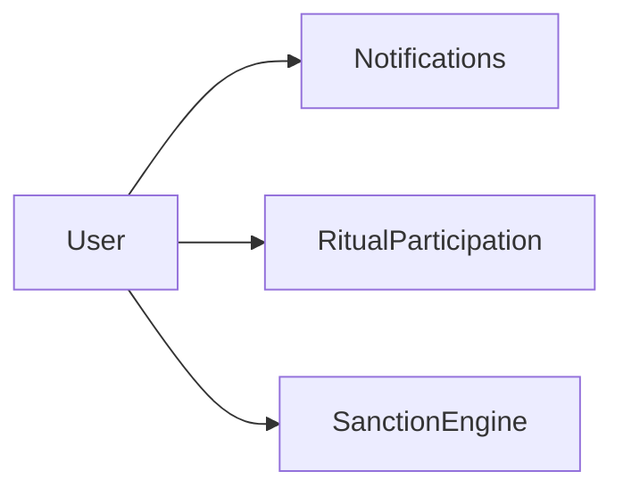
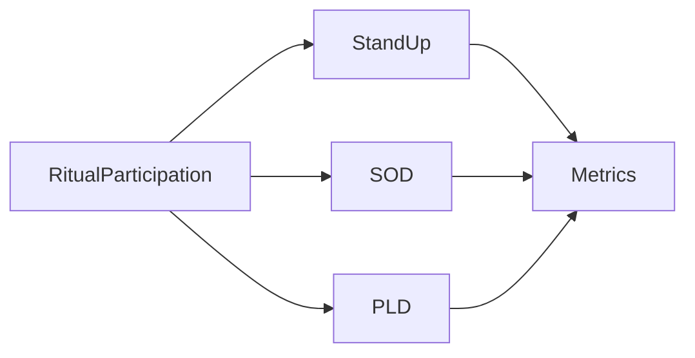

# Holberton Rituals - UML Documentation

## Overview
This documentation presents the complete UML structure of the Holberton Rituals application, a comprehensive system designed to manage and optimize educational rituals.

## Structure

## Components

### Core System
- [User Management](core/user.mmd)
  - User authentication and authorization
  - Role management
  - Basic user information
- [Notification System](core/notifications.mmd)
  - Multi-channel notifications
  - Scheduling and preferences
  - Delivery tracking

### Ritual Management
- [Stand-up](rituals/standup.mmd)
  - Daily meeting management
  - Scrum master rotation
  - Issue tracking
- [SOD](rituals/sod.mmd)
  - Presentation scheduling
  - Submission management
  - Feedback system
- [PLD](rituals/pld.mmd)
  - Group formation
  - SWE instructions
  - Progress tracking

### Participation System
- [Participation Tracking](participation/participation.mmd)
  - Attendance management
  - Role assignment
  - Performance metrics

### Sanction Management
- [Sanctions](sanctions/sanctions.mmd)
  - Automated warning system
  - Progressive sanctions
  - Redemption tracking

### Metrics & Analytics
- [Metrics](metrics/metrics.mmd)
  - Global performance indicators
  - Trend analysis
  - Predictive metrics

## Relationships and Dependencies

### Core Dependencies

### Ritual Dependencies

## Conventions

### Naming Conventions
- Classes: PascalCase (e.g., `UserManager`)
- Enums: PascalCase (e.g., `RitualType`)
- Properties: camelCase (e.g., `firstName`)
- Methods: camelCase (e.g., `calculateScore`)

### Relationship Types
- One-to-One: `1 -- 1`
- One-to-Many: `1 -- *`
- Many-to-Many: `* -- *`

## Maintenance

### Update Procedures
1. Create a new branch for UML updates
2. Update relevant diagram(s)
3. Update this README if necessary
4. Update global.mmd if relationships change
5. Create PR for review

### Validation Checklist
- [ ] All classes properly named
- [ ] All relationships properly defined
- [ ] Enums complete and accurate
- [ ] Methods properly specified
- [ ] README updated
- [ ] Global diagram consistent

## Contributing
Please refer to our [UML Style Guide](../docs/style-guide.md) before making changes to any diagrams.

## Tools Used
- Mermaid for UML diagrams
- VS Code with Mermaid extension
- Git for version control
