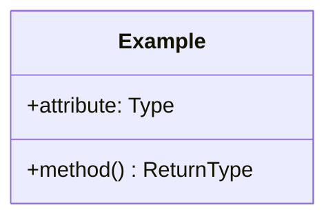

# Diagrammes de Classes UML 📊

Ce répertoire contient les diagrammes de classes définissant la structure orientée objet du système Holberton Rituals.

## 📁 Structure

### Core
- `user.mmd` : Gestion des utilisateurs et des cohortes
- `notifications.mmd` : Système de notifications et préférences

### Metrics

- `metrics.mmd` : Gestion des Métriques pour les statistiques

### Rituals
- `sod.mmd` : Système de tirage au sort SOD
- `standup.mmd` : Gestion des StandUp
- `pld.mmd` : Organisation des groupes PLD

### Gamification
- `points.mmd` : Système de points et récompenses
- `badges.mmd` : Gestion des badges et accomplissements

## 🔍 Conventions de Nommage

- Attributs : camelCase
- Méthodes : snake_case
- Classes : PascalCase
- Énumérations : SCREAMING_SNAKE_CASE

## 📝 Format des Diagrammes

Chaque diagramme suit la structure suivante :

## 🔄 Relations Communes

- Composition : ◆───
- Agrégation : ◇───
- Héritage : ───▷
- Association : ───

## ⚠️ Propriété Intellectuelle

© 2024 Fassih Belmokhtar. Tous droits réservés.